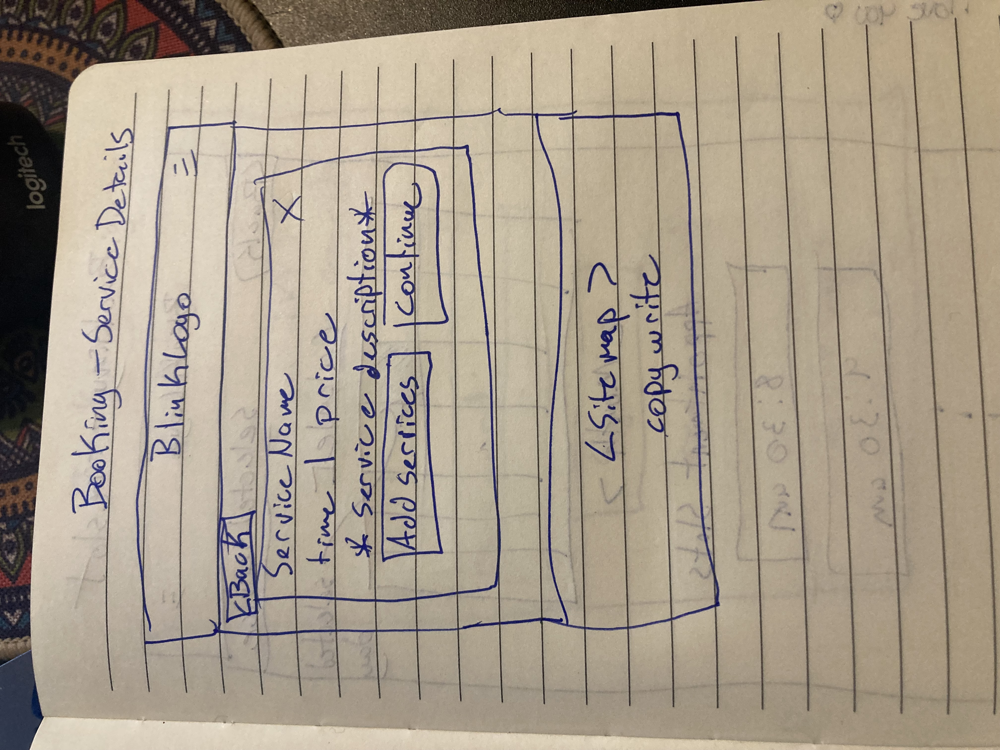

# Blink Lash and Nail Bar
## Overview
This web app will serve as a platform for customers of Blink lash and nail bar to be able to view the nail artists portfolio pictures, see lists of services and prices as well as list contact information and have a contact form.

## Problem
The web app is needed becasue having an online presence will increase business for the nail bar.

## User Profile
### Existing customers:

The web app will be used by existing customers of Blink Lash and Nail Bar to book appointments and see lists of services/photo gallery and submit a contact form

### New customers:

New customers looking for a beauty salon will be able to see Blink LAsh bar as an option.s

## Features
Users will be able to schedule, edit or cancel appoinments. Users will be able to view gallery of work, see testimonials and list of services/prices. Users will be able to submit questions/concerns or book appointments via a contact form.

## Implementation
### Tech Stacks

React Express Node.js MongoDb

### Client Libraries: 

 - react
 - react-router-dom
 - EmailJs
 - react-slick/slick
 - carousel
 - square

### Server Libraries:
 - express
 - mongoose

## APIs
Will use facebooks API to retrieve reviews and also display a live feed of the salons facebook page on the website. Will use Square API to CRUD appointment information and pay for appointments

## Sitemap
Home - hero section, testimonials Services - List of services About - About the nail salon, location, contact info Photo Gallery - photos to showcase portfolio Contact - Contact info/ contact form Book appointment -Service List -Service Details -Timeslot -Register -Sign in -Confirm Appointment -Payment

## Mockups

## Data
Describe your data and the relationships between them. You can show this visually using diagrams, or write it out.

User information stored in database. Site photos stored in database. Making API calls to square to get services/shedule/user information. Making API calls to Meta to get facebook review information.

## Endpoints
List endpoints that your server will implement, including HTTP methods, parameters, and example responses.

### Get /photos

-get photos stored on server

parameters: -type(options are: gallery, hero, logo)

Response:

    [ { "id": 1, "url": "" "type": "gallery" }, ... ]

### Square API calls:

Request: List business locations

curl https://connect.squareupsandbox.com/v2/locations
-H 'Square-Version: 2024-06-04'
-H 'Authorization: Bearer {ACCESS_TOKEN}'
-H 'Content-Type: application/json'

Response: List business locations

    {
      "locations": [
        {
          "id": "EZDZF5AVRBXY4",
          "name": "Default Test Account",
          "address": {
            "address_line_1": "1600 Pennsylvania Ave NW",
            "locality": "Washington",
            "administrative_district_level_1": "DC",
            "postal_code": "20500",
            "country": "US"
          },
          "timezone": "America/Los_Angeles",
          "capabilities": [
            "CREDIT_CARD_PROCESSING"
          ],
          "status": "ACTIVE",
          "created_at": "2020-04-15T00:26:32Z",
          "merchant_id": "AM442MXDT6705",
          "country": "US",
          "language_code": "en-US",
          "currency": "USD",
          "phone_number": "+1 206-222-1111",
          "business_name": "Mr. Mo's Hair",
          "type": "PHYSICAL",
          "business_hours": {
            "periods": [
              {
                "day_of_week": "MON",
                "start_local_time": "09:00:00",
                "end_local_time": "17:00:00"
              },
              {
                "day_of_week": "TUE",
                "start_local_time": "09:00:00",
                "end_local_time": "17:00:00"
              },
              {
                "day_of_week": "WED",
                "start_local_time": "09:00:00",
                "end_local_time": "17:00:00"
              },
              {
                "day_of_week": "THU",
                "start_local_time": "09:00:00",
                "end_local_time": "17:00:00"
              },
              {
                "day_of_week": "FRI",
                "start_local_time": "09:00:00",
                "end_local_time": "17:00:00"
              }
            ]
          },
          "business_email": "sandbox-seller@squareup.com",
          "coordinates": {
            "latitude": 38.897675,
            "longitude": -77.036547
          },
          "mcc": "7299"
        }
      ]
    }

List location booking profiles request

curl https://connect.squareupsandbox.com/v2/bookings/location-booking-profiles?limit=10
-H 'Square-Version: 2024-06-04'
-H 'Authorization: Bearer {ACCESS_TOKEN}'
-H 'Content-Type: application/json'

List location booking profiles response

    {
      "location_booking_profiles": [
        {
          "location_id": "SNTR9180QMFGM",
          "online_booking_enabled": true,
          "booking_site_url": "https://broadway.squareup.com/book/SNTR9180QMFGM/acme-inc-schenectady-ny"
        },
        {
          "location_id": "LHNSEA3K7RYSE",
          "online_booking_enabled": false
        }
      ],
      "errors": []
    }

if error:

    {
      "errors": [
        {
          "category": "INVALID_REQUEST_ERROR",
          "code": "NOT_FOUND",
          "detail": "This location either does not exists, or is not enabled for Bookings."
        }
      ]
    }

Request: List booking profiles of team members

curl https://connect.squareupsandbox.com/v2/bookings/team-member-booking-profiles
-H 'Square-Version: 2024-06-04'
-H 'Authorization: Bearer {ACCESS_TOKEN}'
-H 'Content-Type: application/json'

Response: List booking profiles of team members

    {
      "team_member_booking_profiles": [
        {
          "team_member_id": "pRNYL8gtKDFeFUtvC_Tz",
          "display_name": "Sandbox Seller",
          "is_bookable": true
        }
      ],
      "errors": []
    }

Request: Search for appointment services

curl https://connect.squareupsandbox.com/v2/catalog/search-catalog-items
-X POST
-H 'Square-Version: 2024-06-04'
-H 'Authorization: Bearer {ACCESS_TOKEN}'
-H 'Content-Type: application/json'
-d '{ "product_types": [ "APPOINTMENTS_SERVICE" ] }'

Response: Search for appointment services

    {
      "items": [
        {
          "type": "ITEM",
          "id": "GU3K6H36IETW5BJXNUVQIITT",
          "updated_at": "2020-10-26T05:03:12.977Z",
          "version": 1603688592977,
          "is_deleted": false,
          "present_at_all_locations": true,
          "item_data": {
            "name": "Hand Clean",
            "description": "House cleaning service",
            "variations": [
              {
                "type": "ITEM_VARIATION",
                "id": "YW337JZR267JIALGVE5WWZR7",
                "updated_at": "2020-10-26T05:03:12.977Z",
                "version": 1603688592977,
                "is_deleted": false,
                "present_at_all_locations": true,
                "item_variation_data": {
                  "item_id": "GU3K6H36IETW5BJXNUVQIITT",
                  "name": "Regular",
                  "ordinal": 1,
                  "pricing_type": "FIXED_PRICING",
                  "price_money": {
                    "amount": 8000,
                    "currency": "USD"
                  },
                  "service_duration": 7200000,
                  "available_for_booking": true,
                  "no_show_fee": {
                    "amount": 2500,
                    "currency": "USD"
                  },
                  "transition_time": 0
                }
              },
              {
                "type": "ITEM_VARIATION",
                "id": "KRV4AOIPRWAMSBPBSSU2A2UW",
                "updated_at": "2020-10-26T05:03:12.977Z",
                "version": 1603688592977,
                "is_deleted": false,
                "present_at_all_locations": true,
                "item_variation_data": {
                  "item_id": "GU3K6H36IETW5BJXNUVQIITT",
                  "name": "Power Clean",
                  "ordinal": 2,
                  "pricing_type": "FIXED_PRICING",
                  "price_money": {
                    "amount": 10000,
                    "currency": "USD"
                  },
                  "service_duration": 9000000,
                  "available_for_booking": true,
                }
              }
            ],
            "product_type": "APPOINTMENTS_SERVICE",
            "skip_modifier_screen": false
          }
        },
        {
          "type": "ITEM",
          "id": "EC66KHZQFDXS2CUMBELGF2YK",
          "updated_at": "2020-10-26T05:03:12.977Z",
          "version": 1603688592977,
          "is_deleted": false,
          "present_at_all_locations": true,
          "item_data": {
            "name": "Mr. Mo's Hair",
            "description": "Hair styling for men and women",
            "variations": [
              {
                "type": "ITEM_VARIATION",
                "id": "RCTL5QBJIWUUDWGOX4YWOSNR",
                "updated_at": "2020-10-26T05:03:12.977Z",
                "version": 1603688592977,
                "is_deleted": false,
                "present_at_all_locations": true,
                "item_variation_data": {
                  "item_id": "EC66KHZQFDXS2CUMBELGF2YK",
                  "name": "Men's hair cut",
                  "ordinal": 0,
                  "pricing_type": "FIXED_PRICING",
                  "price_money": {
                    "amount": 2500,
                    "currency": "USD"
                  },
                  "service_duration": 1800000,
                  "transition_time": 0
                }
              },
              {
                "type": "ITEM_VARIATION",
                "id": "RHMBHQBSCELBY6LUR75OCK5H",
                "updated_at": "2020-10-26T05:03:12.977Z",
                "version": 1603688592977,
                "is_deleted": false,
                "present_at_all_locations": true,
                "item_variation_data": {
                  "item_id": "EC66KHZQFDXS2CUMBELGF2YK",
                  "name": "Women's hair styling",
                  "ordinal": 1,
                  "pricing_type": "FIXED_PRICING",
                  "price_money": {
                    "amount": 10000,
                    "currency": "USD"
                  },
                  "service_duration": 7200000
                }
              }
            ],
            "product_type": "APPOINTMENTS_SERVICE"
          }
        }
      ],
      "matched_variation_ids": [
        "YW337JZR267JIALGVE5WWZR7",
        "KRV4AOIPRWAMSBPBSSU2A2UW",
        "RCTL5QBJIWUUDWGOX4YWOSNR",
        "RHMBHQBSCELBY6LUR75OCK5H"
      ]
    }

Request: Create a new customer

curl https://connect.squareupsandbox.com/v2/customers
-X POST
-H 'Square-Version: 2024-06-04'
-H 'Authorization: Bearer {ACCESS_TOKEN}'
-H 'Content-Type: application/json'
-d '{ "given_name": "John", "family_name": "Doe", "email_address": "john.doe@acme.com", "phone_number": "1234567890", "idempotency_key": "{UNIQUE_KEY}" }'

Response: Create a new customer

    {
      "customer": {
        "id": "5XSG36ZZ4WTF32XPGK0A7NZNMC",
        "created_at": "2020-11-02T06:06:13.921Z",
        "updated_at": "2020-11-02T06:06:13Z",
        "given_name": "John",
        "family_name": "Doe",
        "email_address": "john.doe@acme.com",
        "phone_number": "1234567890",
        "preferences": {
          "email_unsubscribed": false
        },
        "creation_source": "THIRD_PARTY",
        "version": 0
      }
    }

Request: Search for a customer by an exact email address

curl https://connect.squareupsandbox.com/v2/customers/search
-X POST
-H 'Square-Version: 2024-06-04'
-H 'Authorization: Bearer {ACCESS_TOKEN}'
-H 'Content-Type: application/json'
-d '{ "query": { "filter": { "email_address": { "exact": "joel@acme.com" } } } }'

Response: Search for a customer by an exact email address

    {
      "customers": [
        {
          "id": "W3T65DYFQCXJXAW72Y677P5SW8",
          "created_at": "2020-07-24T19:49:02.070Z",
          "updated_at": "2020-07-24T19:49:02Z",
          "given_name": "Joel",
          "family_name": "Carpenter",
          "email_address": "joel@acme.com",
          "address": {
            "address_line_1": "1234 major street E",
            "administrative_district_level_1": "WA",
            "postal_code": "98101",
            "country": "US"
          },
          "phone_number": "2061112222",
          "note": "not so private note",
          "company_name": "ACME",
          "preferences": {
            "email_unsubscribed": false
          },
          "creation_source": "THIRD_PARTY",
          "birthday": "2001-01-01T00:00:00-00:00",
          "segment_ids": [
            "AM442MXDT6705.REACHABLE",
            "gv2:Q4N92Z69694EDDNFYFC2D2Q5KG"
          ],
          "version": 3
        }
      ]
    }

Request: Retrieve a business booking profile

curl https://connect.squareupsandbox.com/v2/bookings/business-booking-profile
-H 'Square-Version: 2024-06-04'
-H 'Authorization: Bearer {ACCESS_TOKEN}'
-H 'Content-Type: application/json'

Response: Retrieve a business booking profile

    {
      "business_booking_profile": {
        "seller_id": "AM442MXDT6705",
        "created_at": "2020-10-22T16:38:24Z",
        "booking_enabled": true,
        "customer_timezone_choice": "CUSTOMER_CHOICE",
        "booking_policy": "ACCEPT_ALL",
        "allow_user_cancel": true,
        "business_appointment_settings": {
          "location_types": [
            "BUSINESS_LOCATION"
          ],
          "alignment_time": "HALF_HOURLY",
          "min_booking_lead_time_seconds": 0,
          "max_booking_lead_time_seconds": 31536000,
          "any_team_member_booking_enabled": true,
          "multiple_service_booking_enabled": true,
          "cancellation_fee_money": {
            "currency": "USD"
          },
          "cancellation_policy": "CUSTOM_POLICY",
          "skip_booking_flow_staff_selection": false
        }
      },
      "errors": []
    }

Request: Calling SearchAvailability

    curl https://connect.squareupsandbox.com/v2/bookings/availability/search \
      -X POST \
      -H 'Square-Version: 2024-06-04' \
      -H 'Authorization: Bearer {ACCESS_TOKEN}' \
      -H 'Content-Type: application/json' \
      -d '{
        "query": {
          "filter": {
            "start_at_range": {
              "start_at": "2020-12-01T17:00:00Z",
              "end_at": "2020-12-02T17:00:00Z"
            },
            "location_id": "SNTR5190QMFGM",
            "segment_filters": [
              {
                "service_variation_id": "GUN7HNQBH7ZRARYZN52E7O4B",
                "team_member_id_filter": {
                  "any": [
                    "2_uNFkqPYqV-AZB-7neN"
                  ]
                }
              }
            ]
          }
        }
      }'

Response: Calling SearchAvailability

    {
      "availabilities": [
        {
          "start_at": "2021-12-01T18:30:00Z",
          "location_id": "SNTR5190QMFGM",
          "appointment_segments": [
            {
              "duration_minutes": 60,
              "team_member_id": "2_uNFkqPYqV-AZB-7neN",
              "service_variation_id": "GUN7HNQBH7ZRARYZN52E7O4B",
              "service_variation_version": 1613077495453
            }
          ]
        },
        {
          "start_at": "2021-12-01T19:00:00Z",
          "location_id": "SNTR5190QMFGM",
          "appointment_segments": [
            {
              "duration_minutes": 60,
              "team_member_id": "2_uNFkqPYqV-AZB-7neN",
              "service_variation_id": "GUN7HNQBH7ZRARYZN52E7O4B",
              "service_variation_version": 1613077495453
            }
          ]
        },
        {
          "start_at": "2021-12-01T19:30:00Z",
          "location_id": "SNTR5190QMFGM",
          "appointment_segments": [
            {
              "duration_minutes": 60,
              "team_member_id": "2_uNFkqPYqV-AZB-7neN",
              "service_variation_id": "GUN7HNQBH7ZRARYZN52E7O4B",
              "service_variation_version": 1613077495453
            }
          ]
        },
        {
          "start_at": "2021-12-01T20:00:00Z",
          "location_id": "SNTR5190QMFGM",
          "appointment_segments": [
            {
              "duration_minutes": 60,
              "team_member_id": "2_uNFkqPYqV-AZB-7neN",
              "service_variation_id": "GUN7HNQBH7ZRARYZN52E7O4B",
              "service_variation_version": 1613077495453
            }
          ]
        },
        {
          "start_at": "2021-12-01T20:30:00Z",
          "location_id": "SNTR5190QMFGM",
          "appointment_segments": [
            {
              "duration_minutes": 60,
              "team_member_id": "2_uNFkqPYqV-AZB-7neN",
              "service_variation_id": "GUN7HNQBH7ZRARYZN52E7O4B",
              "service_variation_version": 1613077495453
            }
          ]
        },
        {
          "start_at": "2021-12-01T21:00:00Z",
          "location_id": "SNTR5190QMFGM",
          "appointment_segments": [
            {
              "duration_minutes": 60,
              "team_member_id": "2_uNFkqPYqV-AZB-7neN",
              "service_variation_id": "GUN7HNQBH7ZRARYZN52E7O4B",
              "service_variation_version": 1613077495453
            }
          ]
        },
        {
          "start_at": "2021-12-01T21:30:00Z",
          "location_id": "SNTR5190QMFGM",
          "appointment_segments": [
            {
              "duration_minutes": 60,
              "team_member_id": "2_uNFkqPYqV-AZB-7neN",
              "service_variation_id": "GUN7HNQBH7ZRARYZN52E7O4B",
              "service_variation_version": 1613077495453
            }
          ]
        },
        {
          "start_at": "2021-12-01T22:00:00Z",
          "location_id": "SNTR5190QMFGM",
          "appointment_segments": [
            {
              "duration_minutes": 60,
              "team_member_id": "2_uNFkqPYqV-AZB-7neN",
              "service_variation_id": "GUN7HNQBH7ZRARYZN52E7O4B",
              "service_variation_version": 1613077495453
            }
          ]
        },
        {
          "start_at": "2021-12-01T22:30:00Z",
          "location_id": "SNTR5190QMFGM",
          "appointment_segments": [
            {
              "duration_minutes": 60,
              "team_member_id": "2_uNFkqPYqV-AZB-7neN",
              "service_variation_id": "GUN7HNQBH7ZRARYZN52E7O4B",
              "service_variation_version": 1613077495453
            }
          ]
        },
        {
          "start_at": "2021-12-01T23:00:00Z",
          "location_id": "SNTR5190QMFGM",
          "appointment_segments": [
            {
              "duration_minutes": 60,
              "team_member_id": "2_uNFkqPYqV-AZB-7neN",
              "service_variation_id": "GUN7HNQBH7ZRARYZN52E7O4B",
              "service_variation_version": 1613077495453
            }
          ]
        },
        {
          "start_at": "2021-12-01T23:30:00Z",
          "location_id": "SNTR5190QMFGM",
          "appointment_segments": [
            {
              "duration_minutes": 60,
              "team_member_id": "2_uNFkqPYqV-AZB-7neN",
              "service_variation_id": "GUN7HNQBH7ZRARYZN52E7O4B",
              "service_variation_version": 1613077495453
            }
          ]
        },
        {
          "start_at": "2021-12-02T00:00:00Z",
          "location_id": "SNTR5190QMFGM",
          "appointment_segments": [
            {
              "duration_minutes": 60,
              "team_member_id": "2_uNFkqPYqV-AZB-7neN",
              "service_variation_id": "GUN7HNQBH7ZRARYZN52E7O4B",
              "service_variation_version": 1613077495453
            }
          ]
        }
      ],
      "errors": []
    }

Request: Create a booking

    curl https://connect.squareupsandbox.com/v2/bookings \
      -X POST \
      -H 'Square-Version: 2024-06-04' \
      -H 'Authorization: Bearer {ACCESS_TOKEN}' \
      -H 'Content-Type: application/json' \
      -d '{
        "booking": {
          "customer_id": "K48SGF7H116G59WZJRMYJNJKA8",
          "appointment_segments": [
            {
              "duration_minutes": 60,
              "service_variation_id": "GUN7HNQBH7ZRARYZN52E7O4B",
              "service_variation_version": 1604352990016,
              "team_member_id": "2_uNFkqPYqV-AZB-7neN"
            }
          ],
          "customer_note": "Window seat, please",
          "location_id": "SNTR5190QMFGM",
          "location_type": "BUSINESS_LOCATION",
          "seller_note": "Complementary VIP service",
          "start_at": "2021-12-16T17:00:00Z"
        }
      }'

if errors:

    "errors": [
        {
          "category": "INVALID_REQUEST_ERROR",
          "code": "BAD_REQUEST",
          "detail": "is invalid",
          "field": "phone"
        }
      ]

Response: Create a booking

    {
      "booking": {
        "id": "k1jczlajuhy2xg",
        "version": 0,
        "status": "ACCEPTED",
        "created_at": "2021-11-29T19:14:41Z",
        "updated_at": "2021-11-29T19:14:41Z",
        "location_id": "SNTR5190QMFGM",
        "customer_id": "K48SGF7H116G59WZJRMYJNJKA8",
        "customer_note": "Window seat, please",
        "start_at": "2021-12-16T17:00:00Z",
        "all_day": false,
        "appointment_segments": [
          {
            "duration_minutes": 60,
            "service_variation_id": "GUN7HNQBH7ZRARYZN52E7O4B",
            "team_member_id": "2_uNFkqPYqV-AZB-7neN",
            "service_variation_version": 1613077495453,
            "any_team_member": false,
            "intermission_minutes": 0
          }
        ],
        "seller_note": "Complementary VIP service",
        "transition_time_minutes": 0,
        "creator_details": {
          "creator_type": "TEAM_MEMBER",
          "team_member_id": "2_uNFkqPYqV-AZB-7neN"
        },
        "source": "API",
        "location_type": "BUSINESS_LOCATION"
      },
      "errors": []
    }

Request: Retrieve a booking

curl https://connect.squareupsandbox.com/v2/bookings/k1jczlajuhy2xg
-H 'Square-Version: 2024-06-04'
-H 'Authorization: Bearer {ACCESS_TOKEN}'
-H 'Content-Type: application/json'

Response: Retrieve a booking

    {
      "booking": {
        "id": "k1jczlajuhy2xg",
        "version": 0,
        "status": "ACCEPTED",
        "created_at": "2021-11-29T19:14:41Z",
        "updated_at": "2021-11-29T19:14:41Z",
        "location_id": "SNTR5190QMFGM",
        "customer_id": "K48SGF7H116G59WZJRMYJNJKA8",
        "customer_note": "Window seat, please",
        "start_at": "2021-12-16T17:00:00Z",
        "all_day": false,
        "appointment_segments": [
          {
            "duration_minutes": 60,
            "service_variation_id": "GUN7HNQBH7ZRARYZN52E7O4B",
            "team_member_id": "2_uNFkqPYqV-AZB-7neN",
            "service_variation_version": 1613077495453,
            "any_team_member": false,
            "intermission_minutes": 0
          }
        ],
        "seller_note": "Complementary VIP service",
        "transition_time_minutes": 0,
        "creator_details": {
          "creator_type": "TEAM_MEMBER",
          "team_member_id": "2_uNFkqPYqV-AZB-7neN"
        },
        "source": "API",
        "location_type": "BUSINESS_LOCATION"
      },
      "errors": []
    }

Request: List bookings at a location and a start-time range

curl https://connect.squareupsandbox.com/v2/bookings?location_id=SNTR5190QMFGM&start_at_min=2021-12-01T00%3A00%3A00Z&start_at_max=2021-12-30T23%3A59%3A59Z
-H 'Square-Version: 2024-06-04'
-H 'Authorization: Bearer {ACCESS_TOKEN}'
-H 'Content-Type: application/json'

Response: List bookings at a location and a start-time range

    {
      "bookings": [
        {
          "id": "b3s9u8hu1ceaug",
          "version": 0,
          "status": "ACCEPTED",
          "created_at": "2021-11-16T18:21:12Z",
          "updated_at": "2021-11-30T17:55:21Z",
          "location_id": "SNTR5190QMFGM",
          "customer_id": "SWPBCE0VRCXSQ57EEJ1PP77TKG",
          "customer_note": "John's hair",
          "start_at": "2021-12-01T18:00:00Z",
          "all_day": false,
          "appointment_segments": [
            {
              "duration_minutes": 30,
              "service_variation_id": "GUN7HNQBH7ZRARYZN52E7O4B",
              "team_member_id": "2_uNFkqPYqV-AZB-7neN",
              "service_variation_version": 1613077495453,
              "any_team_member": false,
              "intermission_minutes": 0
            }
          ],
          "seller_note": "",
          "transition_time_minutes": 0,
          "creator_details": {
            "creator_type": "CUSTOMER"
          },
          "source": "API",
          "location_type": "BUSINESS_LOCATION"
        },
        {
          "id": "k1jczlajuhy2xg",
          "version": 0,
          "status": "ACCEPTED",
          "created_at": "2021-11-29T19:14:41Z",
          "updated_at": "2021-11-29T19:14:41Z",
          "location_id": "SNTR5190QMFGM",
          "customer_id": "K48SGF7H116G59WZJRMYJNJKA8",
          "customer_note": "Window seat, please",
          "start_at": "2021-12-16T17:00:00Z",
          "all_day": false,
          "appointment_segments": [
            {
              "duration_minutes": 60,
              "service_variation_id": "GUN7HNQBH7ZRARYZN52E7O4B",
              "team_member_id": "2_uNFkqPYqV-AZB-7neN",
              "service_variation_version": 1613077495453,
              "any_team_member": false,
              "intermission_minutes": 0
            }
          ],
          "seller_note": "Complementary VIP service",
          "transition_time_minutes": 0,
          "creator_details": {
            "creator_type": "TEAM_MEMBER",
            "team_member_id": "2_uNFkqPYqV-AZB-7neN"
          },
          "source": "API",
          "location_type": "BUSINESS_LOCATION"
        }
      ],
      "errors": []
    }

Request: Update a booking to a new start time and date

curl https://connect.squareupsandbox.com/v2/bookings/k1jczlajuhy2xg
-X PUT
-H 'Square-Version: 2024-06-04'
-H 'Authorization: Bearer {ACCESS_TOKEN}'
-H 'Content-Type: application/json'
-d '{ "booking": { "start_at": "2021-12-17T18:00:00Z" } }'

Response: Update a booking to a new start time and date

    {
      "booking": {
        "id": "k1jczlajuhy2xg",
        "version": 1,
        "status": "ACCEPTED",
        "created_at": "2021-11-29T19:14:41Z",
        "updated_at": "2021-11-29T22:44:53Z",
        "location_id": "SNTR5190QMFGM",
        "customer_id": "K48SGF7H116G59WZJRMYJNJKA8",
        "start_at": "2021-12-16T18:00:00Z",
        "all_day": false,
        "appointment_segments": [
          {
            "duration_minutes": 60,
            "service_variation_id": "GUN7HNQBH7ZRARYZN52E7O4B",
            "team_member_id": "2_uNFkqPYqV-AZB-7neN",
            "service_variation_version": 1613077495453,
            "any_team_member": false,
            "intermission_minutes": 0
          }
        ],
        "seller_note": "Complementary VIP service",
        "transition_time_minutes": 0,
        "creator_details": {
          "creator_type": "TEAM_MEMBER",
          "team_member_id": "2_uNFkqPYqV-AZB-7neN"
        },
        "source": "API",
        "location_type": "BUSINESS_LOCATION"
      },
      "errors": []
    }

Request: Cancel a booking

curl https://connect.squareupsandbox.com/v2/bookings/k1jczlajuhy2xg/cancel
-X POST
-H 'Square-Version: 2024-06-04'
-H 'Authorization: Bearer {ACCESS_TOKEN}'
-H 'Content-Type: application/json'
-d '{ "booking_version": "1" }'

Response: Cancel a booking

    {
      "booking": {
        "id": "k1jczlajuhy2xg",
        "version": 2,
        "status": "CANCELLED_BY_SELLER",
        "created_at": "2021-11-29T19:14:41Z",
        "updated_at": "2021-11-30T00:20:31Z",
        "location_id": "SNTR5190QMFGM",
        "customer_id": "K48SGF7H116G59WZJRMYJNJKA8",
        "start_at": "2021-12-16T18:00:00Z",
        "all_day": false,
        "appointment_segments": [
          {
            "duration_minutes": 60,
            "service_variation_id": "GUN7HNQBH7ZRARYZN52E7O4B",
            "team_member_id": "2_uNFkqPYqV-AZB-7neN",
            "service_variation_version": 1613077495453,
            "any_team_member": false,
            "intermission_minutes": 0
          }
        ],
        "seller_note": "Complementary VIP service",
        "transition_time_minutes": 0,
        "creator_details": {
          "creator_type": "TEAM_MEMBER",
          "team_member_id": "2_uNFkqPYqV-AZB-7neN"
        },
        "source": "API",
        "location_type": "BUSINESS_LOCATION"
      },
      "errors": []
    }
    
    if errors:
    
    {
      "errors": [
        {
          "category": "INVALID_REQUEST_ERROR",
          "code": "BAD_REQUEST",
          "detail": "The cancellation period for this booking has ended.",
          "field": "base"
        }
      ]
    }

## Auth
-JWT Auth

## Roadmap
Scope your project as a sprint. Break down the tasks that will need to be completed and map out timeframes for implementation. Think about what you can reasonably complete before the due date. The more detail you provide, the easier it will be to build.

 - -implement responsive design for tablet/desktops
 - -feature: Home page
 - -feature: Gallery page
 - -feature: Services Page
 - -feature: About page
 - -feature: Contact Page
 - -feature: booking system
	 - -service list
	 - -service details
	 - -timeslot
	 - -register
	 - -sign in
	 - -confirm
 - -feature: Contact form with validation/styling
 - -feature: EmailJS to send email to client from contact form
 - -feature: testimonials section pulled from facebook
 - -feature: header
	 - hide when scrolling
 - -final styling
 - -Bug fixes
 - -DEMO

## Nice-to-haves
Your project will be marked based on what you committed to in the above document. Under nice-to-haves, you can list any additional features you may complete if you have extra time, or after finishing.

-I want to actually deploy this website for my clients customers to use and to attract more business to the salon. -Nice to have a shop to display and be able to purchase items available at the salon -Nice to have an admin login to be able to easily update gallery photos/ services/prices

## React + Vite
This template provides a minimal setup to get React working in Vite with HMR and some ESLint rules.

Currently, two official plugins are available:

@vitejs/plugin-react uses Babel for Fast Refresh
@vitejs/plugin-react-swc uses SWC for Fast Refresh

